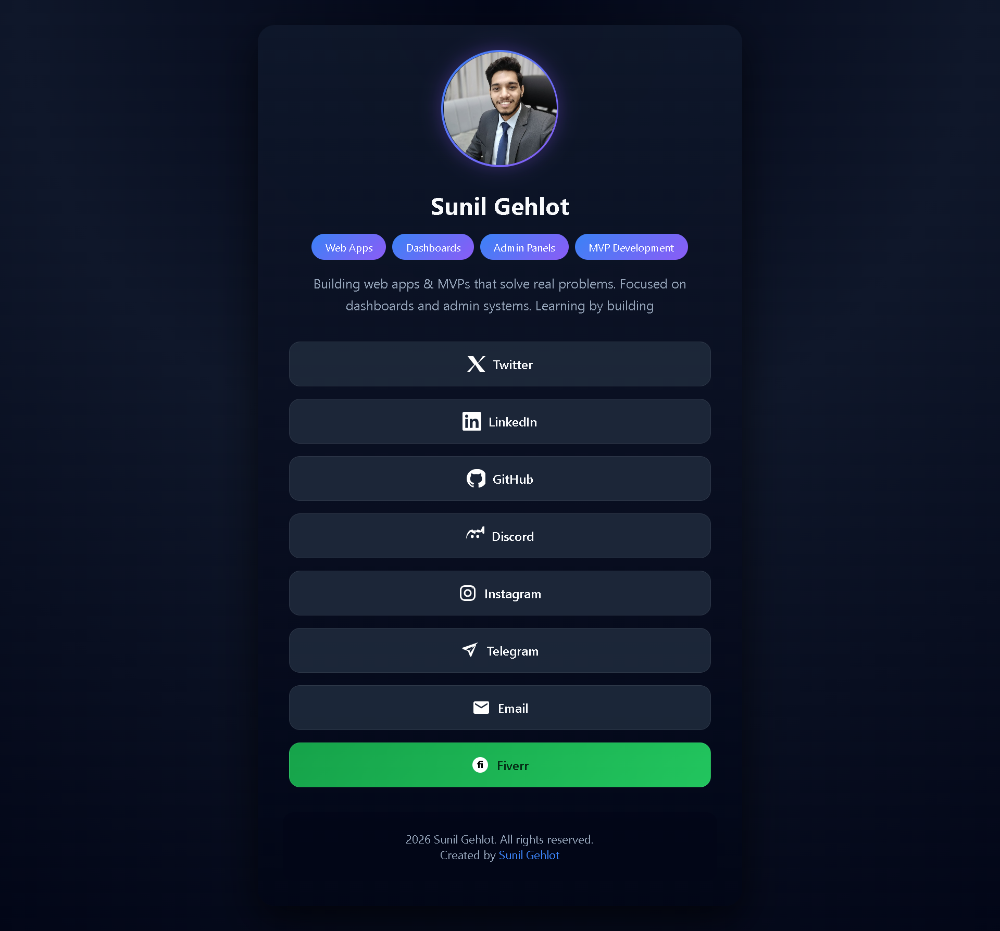

# Social Links Website 🔗

A clean and responsive social media links website inspired by Linktree.

This project allows you to keep all your important links in one place with a simple, modern UI.

---

## 🔗 Live Demo
[https://sunil-links.vercel.app/]

---

## ✨ Features
- Clean and minimal UI  
- Fully responsive (mobile & desktop)  
- Fast and lightweight  
- Easy to customize links  

---

## 🛠️ Tech Stack
- HTML  
- CSS  
- JavaScript  

---

## 📸 Preview

---

## 🎯 Why I Built This
- To practice responsive layouts  
- To improve UI/UX design skills  
- To create a personal link hub  

---

## 🚀 Future Improvements
- Smooth animations  
- Dark / Light mode  
- Custom themes  
- Link analytics  

---

## 🙌 Feedback
Feedback is always welcome!  
If you have suggestions, feel free to open an issue or connect with me.

---

## 👨‍💻 Author
**Sunil Gehlot**  
Web App Developer 🚀
